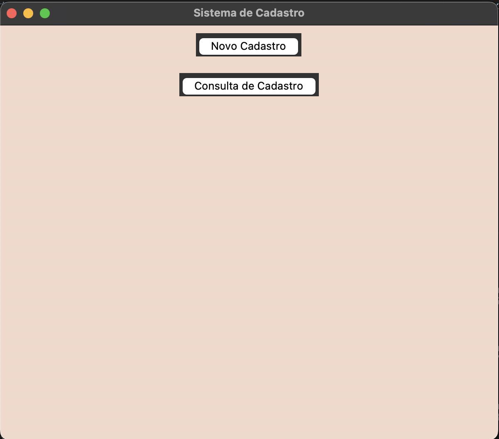
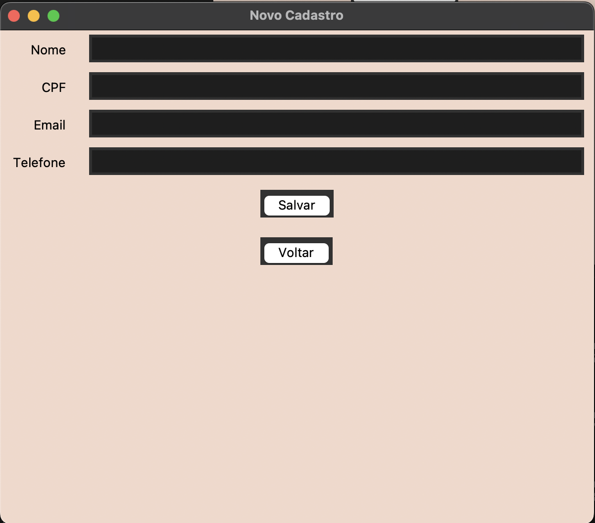
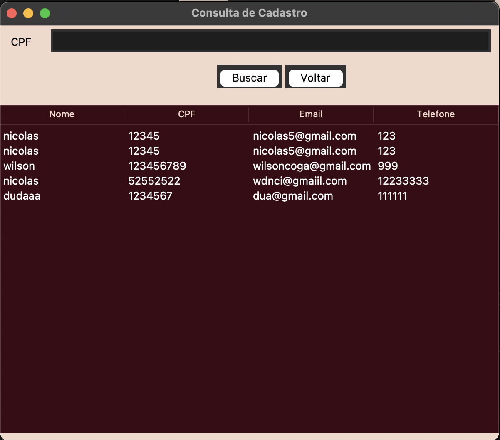
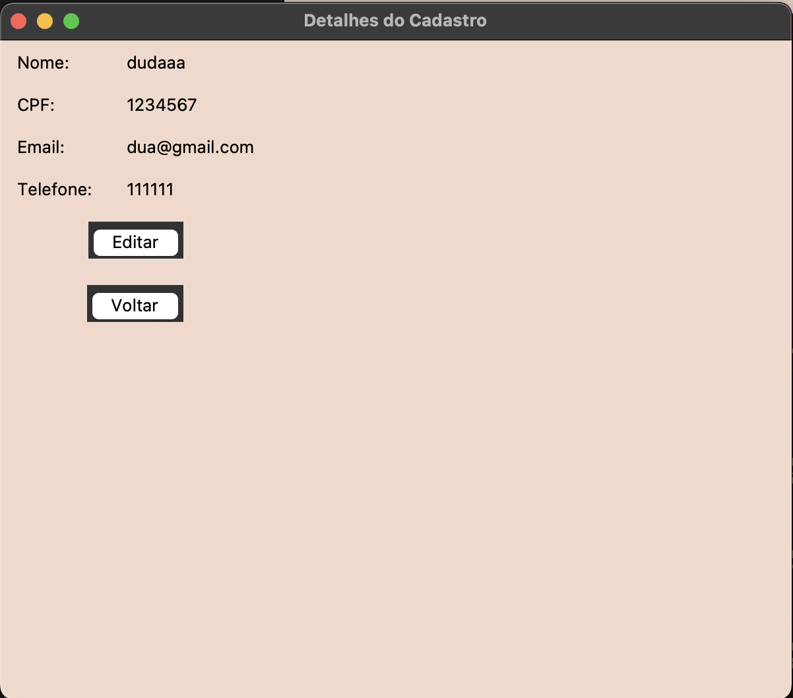

##Sistema de Cadastro de Clientes

Estou animado em compartilhar meu mais recente projeto de desenvolvimento em Python: um Sistema de Cadastro de Clientes construído com a biblioteca Tkinter. O objetivo deste projeto é criar uma aplicação intuitiva para gerenciar o cadastro de clientes, permitindo realizar operações como registrar novos clientes, consultar, editar e remover cadastros, tudo em uma interface gráfica simples e eficaz.

🔧 Tecnologias Utilizadas:
Python: Linguagem de programação principal do projeto.
Tkinter: Biblioteca utilizada para criar a interface gráfica.
Pandas: Utilizada para manipulação e armazenamento de dados no arquivo Excel.
Excel (xlsx): Armazenamento persistente dos dados cadastrados.
⚙️ Funcionalidades:
Novo Cadastro: Registre clientes com informações como nome, CPF, email e telefone.
Consulta de Cadastro: Busque clientes pelo CPF e visualize seus detalhes.
Edição de Cadastro: Atualize informações como nome, email e telefone.
Remoção de Cadastro: Exclua registros de clientes do sistema.
Validação de Dados: Evita o cadastro duplicado de CPF.

Tela inicial:

Tela de cadastro

Tela de consulta de cadastro

Tela de detalhe de cadastro

Tela de edição de cadastro

